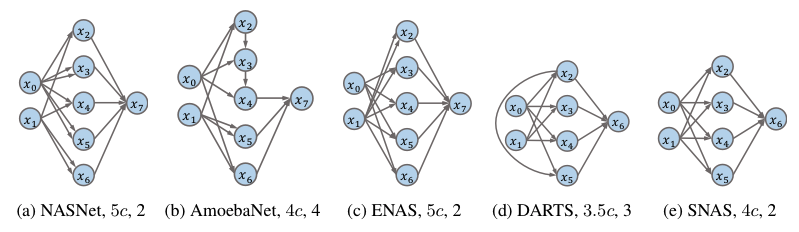
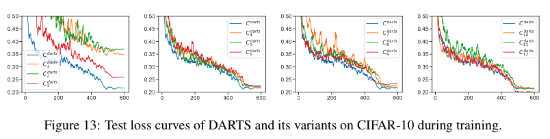
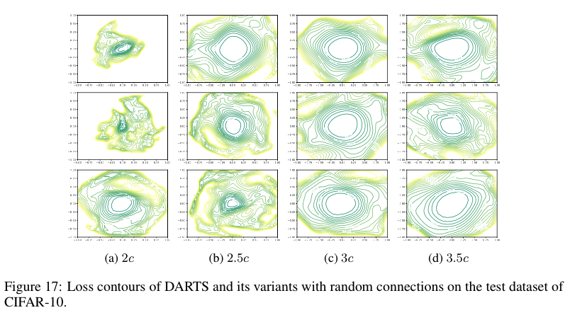
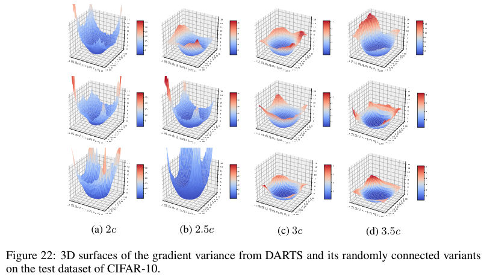

# Understanding Architectures Learnt by Cell-based Neural Architecture Search [\[Arxiv\]](https://arxiv.org/abs/1909.09569)

---

Codes accompanying our paper. The codes are mainly based on the work of [DARTS](https://github.com/quark0/darts) and [Visualizing the Loss Landscape of Neural Nets](https://github.com/tomgoldstein/loss-landscape). The codes for visualization are ignored since it's nearly the same as the codes [here](https://github.com/tomgoldstein/loss-landscape).



Our work is the first to investigate the architectures learnt by NAS algorithms, which is to answer following questions:

- What kind of architectures NAS algorithms are learning?
- Why NAS algorithms favor these architectures?

> In this paper, we first reveal that existing NAS algorithms (e.g., DARTS,ENAS) tend to favor architectures with wide and shallow cell structures. These favorable architectures consistently achieve fast convergence and are consequently selected by NAS algorithms. Our empirical and theoretical study further confirms that their fast convergence derives from their smooth loss landscape and accurate gradient information. 

## Visualization
### Convergence
Fast and stable convergence is observed in architectures with wide and shallow cell structures. The width and depth from c1 to c12 are increasing and decreasing respectively.



### Loss Contour
Smooth loss contour is observed in architectures with wide and shallow cell structures.



### Gradient Variance
Small gradient variance is observed in architectures with wide and shallow cell structures.



## Citation
```
@inproceedings{
    shu2020understanding,
    title={Understanding Architectures Learnt by Cell-based Neural Architecture Search},
    author={Yao Shu and Wei Wang and Shaofeng Cai},
    booktitle={International Conference on Learning Representations},
    year={2020},
    url={https://openreview.net/forum?id=BJxH22EKPS}
}
```